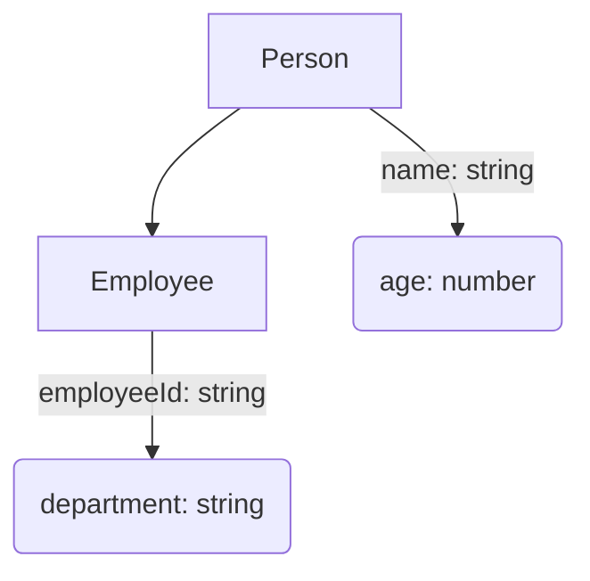

# TypeScript Tutorial: Mastering the Fundamentals - Day 1

Welcome to Day 1 of our comprehensive TypeScript tutorial series! If you're a JavaScript developer looking to scale your applications, improve code quality, and boost developer productivity, you've landed in the right place. TypeScript isn't just a language; it's a powerful toolset that transforms your JavaScript development experience, bringing static typing, robust tooling, and enhanced maintainability to your projects.

While you might be familiar with JavaScript's dynamic nature, TypeScript introduces a layer of predictability and structure that becomes invaluable in large codebases. It's not about replacing JavaScript but augmenting it, allowing you to catch errors at compile-time rather than runtime, making refactoring safer, and providing a clearer contract for your code. This first day focuses on laying a solid foundation: understanding core types, functions, object shapes, and how TypeScript helps you write more reliable code from the ground up.

By the end of this session, you'll have a firm grasp of TypeScript's foundational elements, preparing you for more advanced topics. We'll dive into practical examples, common pitfalls, and best practices that senior engineers leverage daily. Let's begin our journey into building more robust and maintainable applications with TypeScript.

## TypeScript: More Than Just Static Types

At its heart, TypeScript is a superset of JavaScript. This means any valid JavaScript code is also valid TypeScript code. What TypeScript adds is an optional static type system. This system allows you to define the *shape* of your data and the *types* of values your variables, function parameters, and return values will hold.

The real magic of TypeScript isn't just the type checking itself, but the developer experience it unlocks:

*   **Early Error Detection:** Catch type-related errors during development (or compilation) instead of waiting for runtime.
*   **Enhanced Tooling:** IDEs (like VS Code) can provide intelligent autocompletion, navigate definitions, and offer refactoring suggestions with high accuracy.
*   **Improved Readability and Maintainability:** Explicit types act as living documentation, making code easier to understand and reason about, especially in large teams.
*   **Safer Refactoring:** When you change a type, TypeScript immediately highlights all places in your codebase that are affected, ensuring you don't introduce regressions.

Let's quickly see how a TypeScript file compiles into plain JavaScript:

```typescript
// greeting.ts
function greet(name: string) {
  console.log(`Hello, ${name.toUpperCase()}!`);
}

greet("TypeScript");
// greet(123); // This would be a compile-time error!
```

To compile this, you'd run:

```bash
tsc greeting.ts
```

This command generates `greeting.js`:

```javascript
// greeting.js
function greet(name) {
  console.log(`Hello, ${name.toUpperCase()}!`);
}
greet("TypeScript");
// greet(123); // No error here in JS, as types are stripped
```

Notice how the type annotation `: string` is removed. TypeScript's type system is a compile-time construct, meaning it has no runtime overhead.

## Fundamental Types & Type Inference

TypeScript provides all the primitive types you'd expect from JavaScript, along with some special types that enhance its type system.

### Core Primitives

*   `number`: For all numeric values (integers and floats).
*   `string`: For text.
*   `boolean`: For `true`/`false`.
*   `null` and `undefined`: For explicit absence of value.
*   `symbol`: For unique, immutable values (ES6 feature).
*   `bigint`: For very large integers (ES2020 feature).

```typescript
let age: number = 30;
let userName: string = "Alice";
let isActive: boolean = true;
let emptyValue: null = null;
let notAssigned: undefined = undefined;

const idSymbol: symbol = Symbol('user_id');
const veryLargeNumber: bigint = 9007199254740991n; // 'n' suffix for BigInt literals
```

### `void`, `never`, and `unknown` (The Nuances)

These types are crucial for accurately describing different scenarios.

*   **`void`**: Used for functions that do not return any value.
    ```typescript
    function logMessage(message: string): void {
      console.log(message);
      // return "oops"; // Error: Type 'string' is not assignable to type 'void'.
    }
    ```
*   **`never`**: Represents the type of values that *never* occur. This is used for functions that always throw an error or functions that never return (e.g., infinite loops).
    ```typescript
    function throwError(message: string): never {
      throw new Error(message);
    }

    function infiniteLoop(): never {
      while (true) { /* ... */ }
    }
    ```
*   **`any` vs. `unknown` (The Safer Choice)**:
    *   **`any`**: The "escape hatch." A variable of type `any` can hold *any* value, and you can perform *any* operation on it without type checking. This effectively opts out of TypeScript's type system for that variable, undermining its benefits.
        ```typescript
        let data: any = "hello";
        data = 10;
        data.toUpperCase(); // No error, but might fail at runtime if `data` is a number
        ```
    *   **`unknown`**: A much safer alternative to `any`. A variable of type `unknown` can hold *any* value, but you *must* perform type checking or a type assertion before you can perform operations on it. This forces you to handle the `unknown` value safely.
        ```typescript
        let rawInput: unknown;
        rawInput = JSON.parse('{"name": "Alice", "age": 30}'); // Could be anything

        // rawInput.name; // Error: Object is of type 'unknown'.
        // rawInput.toUpperCase(); // Error: Object is of type 'unknown'.

        // To use it, you must narrow its type:
        if (typeof rawInput === 'object' && rawInput !== null && 'name' in rawInput) {
          console.log((rawInput as { name: string }).name); // Type assertion or proper narrowing
        }
        // A better way with type guard:
        if (typeof rawInput === 'string') {
            console.log(rawInput.toUpperCase()); // OK, type is narrowed to string
        }
        ```
        **Best Practice**: Favor `unknown` over `any` whenever you're dealing with values of uncertain types.

### Type Inference

TypeScript is smart. In many cases, it can automatically deduce the type of a variable, parameter, or return value based on its initial assignment or usage. This is called type inference.

```typescript
let price = 100; // TypeScript infers `price` as `number`
// price = "expensive"; // Error: Type 'string' is not assignable to type 'number'.

let message = "Hello World"; // TypeScript infers `message` as `string`

function calculateArea(length: number, width: number) {
    return length * width; // TypeScript infers the return type as `number`
}
```
While inference is great, it's often a best practice to explicitly type function parameters and return types for clarity and to catch errors early, especially in public APIs or complex logic.

## Functions: Typing Inputs, Outputs, and Overloads

Functions are fundamental building blocks, and TypeScript provides powerful ways to type them precisely.

### Basic Function Typing

You can specify types for parameters and the return value.

```typescript
function add(a: number, b: number): number {
  return a + b;
}

function greetUser(firstName: string, lastName: string): string {
  return `Welcome, ${firstName} ${lastName}!`;
}

// add(10, "5"); // Error: Argument of type 'string' is not assignable to parameter of type 'number'.
```

### Optional and Default Parameters

*   **Optional Parameters**: Marked with `?`. They must come after all required parameters.
    ```typescript
    function showProfile(name: string, age?: number): string {
      if (age) {
        return `${name} is ${age} years old.`;
      }
      return `${name} has no age specified.`;
    }

    console.log(showProfile("Anna"));        // Anna has no age specified.
    console.log(showProfile("Bob", 25));    // Bob is 25 years old.
    ```
*   **Default Parameters**: Provide a default value if the argument is omitted. These also become optional implicitly.
    ```typescript
    function calculateDiscount(price: number, discount: number = 0.05): number {
      return price * (1 - discount);
    }

    console.log(calculateDiscount(100));     // 95 (5% discount)
    console.log(calculateDiscount(100, 0.1)); // 90 (10% discount)
    ```

### Rest Parameters

When you want to work with a variable number of arguments, use rest parameters, which gather them into an array.

```typescript
function sumAllNumbers(...numbers: number[]): number {
  return numbers.reduce((total, num) => total + num, 0);
}

console.log(sumAllNumbers(1, 2, 3));         // 6
console.log(sumAllNumbers(10, 20, 30, 40));  // 100
```

### Function Overloads

Function overloads allow you to define multiple function signatures for a single function implementation. This is useful when a function can accept different types or numbers of arguments and behave differently based on them, but you want to provide precise type information for each call signature.

```typescript
// Overload Signatures
function processInput(input: string): string;
function processInput(input: number): number;
function processInput(input: boolean): boolean;

// Implementation Signature (must be compatible with all overloads)
function processInput(input: string | number | boolean): string | number | boolean {
  if (typeof input === 'string') {
    return input.toUpperCase();
  } else if (typeof input === 'number') {
    return input * 2;
  } else if (typeof input === 'boolean') {
    return !input;
  }
  // This part should ideally be unreachable if overloads cover all cases
  // For stricter types, you might use 'never' here:
  // throw new Error("Invalid input type");
}

console.log(processInput("hello"));   // HELLO (string overload chosen)
console.log(processInput(10));        // 20 (number overload chosen)
console.log(processInput(true));      // false (boolean overload chosen)

// processInput({}); // Error: No overload matches this call.
```
The implementation signature (`function processInput(input: string | number | boolean): ...`) is not directly callable by external code; it's only there to provide the actual logic. TypeScript only considers the overload signatures for type checking when you call `processInput`.

## Object Types & Interfaces: Structuring Your Data

One of TypeScript's most powerful features is its ability to describe the shape of objects. This is crucial for working with complex data structures like configuration objects, API responses, or state objects in UI frameworks.

### Anonymous Object Types

You can describe an object's shape inline. This is fine for simple, one-off objects.

```typescript
function printCoordinates(pt: { x: number; y: number }) {
  console.log(`The coordinate's x value is ${pt.x}`);
  console.log(`The coordinate's y value is ${pt.y}`);
}

printCoordinates({ x: 3, y: 7 });
// printCoordinates({ x: "3", y: 7 }); // Error: Type 'string' is not assignable to type 'number'.
```

### Interfaces (The Standard for Object Shapes)

Interfaces are a way to name object types, allowing for reusability, extensibility, and better readability. They are a core concept for defining contracts in your application.

```typescript
interface User {
  id: number;
  name: string;
  email?: string; // Optional property
  readonly createdAt: Date; // Readonly property
}

const currentUser: User = {
  id: 1,
  name: "Jane Doe",
  email: "jane.doe@example.com",
  createdAt: new Date(),
};

// currentUser.id = 2; // OK
// currentUser.createdAt = new Date(); // Error: Cannot assign to 'createdAt' because it is a read-only property.

const guestUser: User = {
  id: 2,
  name: "Guest",
  createdAt: new Date(), // email is optional
};
```

#### Extending Interfaces

Interfaces can extend one another, allowing you to build up complex types from simpler ones.

```typescript
interface Person {
  name: string;
  age: number;
}

interface Employee extends Person {
  employeeId: string;
  department: string;
}

const softwareEngineer: Employee = {
  name: "John Smith",
  age: 35,
  employeeId: "TS-1001",
  department: "Engineering",
};

console.log(`${softwareEngineer.name} (ID: ${softwareEngineer.employeeId}) works in ${softwareEngineer.department}.`);
```

Here's a simple Mermaid diagram illustrating interface extension:



### Type Aliases (Versatile Type Naming)

Type aliases, created with the `type` keyword, are another way to give a name to any type, not just object types. They are more versatile than interfaces because they can name primitives, union types, tuples, and more.

```typescript
// Alias for a primitive type
type UserId = string;
let userId: UserId = "abc-123";

// Alias for a complex object type (similar to interface)
type Product = {
  id: string;
  name: string;
  price: number;
};

const myProduct: Product = {
  id: "prod-001",
  name: "Laptop",
  price: 1200,
};

// Alias for a union type (coming up next!)
type Status = "pending" | "fulfilled" | "rejected";
let orderStatus: Status = "pending";
// orderStatus = "delivered"; // Error: Type '"delivered"' is not assignable to type 'Status'.
```

#### Interfaces vs. Type Aliases: When to use which?

*   **Interfaces**: Primarily used for defining the shape of objects. They are better for declaration merging (where multiple declarations of the same interface are merged into one), which is useful for library authors. Can be `implements` by classes.
*   **Type Aliases**: More versatile. Can name any type, including primitives, unions, tuples, and intersections. Cannot benefit from declaration merging.

**General Guideline**: For defining object shapes, prefer `interface`. For all other types (unions, primitives, tuples), use `type`.

## Union, Intersection, and Type Guards

TypeScript provides powerful ways to combine existing types to create new ones, increasing flexibility and type safety.

### Union Types (`|`)

A union type describes a value that can be *one of several* types. The `|` symbol is used to denote a union.

```typescript
function printId(id: number | string) {
  console.log(`Your ID is: ${id}`);
}

printId(101);
printId("202ABC");
// printId(true); // Error: Argument of type 'boolean' is not assignable to parameter of type 'string | number'.
```

When working with union types, you often need to narrow the type to perform operations specific to one of the constituent types. This is where **Type Guards** come in.

### Intersection Types (`&`)

An intersection type combines *multiple types into one*. A value of an intersection type must possess the properties of *all* combined types. The `&` symbol is used.

```typescript
interface HasName {
  name: string;
}

interface HasAge {
  age: number;
}

// A Person has both a name AND an age
type PersonDetails = HasName & HasAge;

const customer: PersonDetails = {
  name: "Alice",
  age: 30,
};

// const incompleteCustomer: PersonDetails = { name: "Bob" }; // Error: Property 'age' is missing.
```

### Type Guards (Narrowing Types)

Type guards are expressions that perform a runtime check to guarantee the type in some scope. This allows TypeScript to understand which specific type you're working with from a union.

1.  **`typeof` Type Guard**: Checks for primitive types.
    ```typescript
    function logValue(x: string | number) {
      if (typeof x === "string") {
        // x is now known to be a string
        console.log(x.toUpperCase());
      } else {
        // x is now known to be a number
        console.log(x.toFixed(2));
      }
    }

    logValue("hello");
    logValue(123.456);
    ```

2.  **`instanceof` Type Guard**: Checks if a value is an instance of a class.
    ```typescript
    class Dog {
      bark() { console.log("Woof!"); }
    }
    class Cat {
      meow() { console.log("Meow!"); }
    }

    function animalSound(animal: Dog | Cat) {
      if (animal instanceof Dog) {
        animal.bark(); // animal is Dog
      } else {
        animal.meow(); // animal is Cat
      }
    }

    animalSound(new Dog());
    animalSound(new Cat());
    ```

3.  **`in` Operator Type Guard**: Checks if an object has a certain property.
    ```typescript
    interface Car {
      drive(): void;
    }

    interface Plane {
      fly(): void;
    }

    function transport(vehicle: Car | Plane) {
      if ("drive" in vehicle) {
        vehicle.drive(); // vehicle is Car
      } else {
        vehicle.fly(); // vehicle is Plane
      }
    }
    ```

4.  **Custom Type Guards**: You can define your own type guard functions using a "type predicate" in their return type (`parameterName is Type`).
    ```typescript
    interface Admin {
      name: string;
      roles: string[];
    }

    interface User {
      name: string;
      email: string;
    }

    function isAdmin(account: Admin | User): account is Admin {
      return (account as Admin).roles !== undefined;
    }

    function getAccountInfo(account: Admin | User) {
      if (isAdmin(account)) {
        console.log(`Admin: ${account.name}, Roles: ${account.roles.join(', ')}`);
      } else {
        console.log(`User: ${account.name}, Email: ${account.email}`);
      }
    }

    getAccountInfo({ name: "Boss", roles: ["admin", "editor"] });
    getAccountInfo({ name: "Reader", email: "reader@example.com" });
    ```
    Custom type guards are incredibly powerful for creating highly specific narrowing logic tailored to your application's domain.

## Real-World Use Cases

Understanding these fundamentals isn't just academic; they're applied constantly in production systems.

### 1. Typing API Responses

Imagine fetching data from an API. You need to ensure the data structure matches what your application expects.

```typescript
interface ApiResponse {
  status: 'success' | 'error';
  data?: UserProfile | null; // Optional property that can be UserProfile or null
  message?: string;
}

interface UserProfile {
  id: string;
  username: string;
  email: string;
  preferences: {
    theme: 'dark' | 'light';
    notifications: boolean;
  };
}

async function fetchUserProfile(userId: string): Promise<ApiResponse> {
  // In a real app, this would be a network request
  const response: ApiResponse = {
    status: 'success',
    data: {
      id: userId,
      username: `user_${userId}`,
      email: `${userId}@example.com`,
      preferences: {
        theme: 'dark',
        notifications: true,
      },
    },
  };
  // Or for an error:
  // const errorResponse: ApiResponse = { status: 'error', message: 'User not found' };

  return response;
}

// Usage
fetchUserProfile('123').then(res => {
  if (res.status === 'success' && res.data) {
    console.log(`User ${res.data.username} prefers ${res.data.preferences.theme} theme.`);
  } else {
    console.error(`Failed to fetch profile: ${res.message}`);
  }
});
```
This ensures that `res.data` is only accessed if `status` is 'success' and `data` actually exists, preventing runtime errors.

### 2. Configuration Objects

Application configurations can be complex. Typing them ensures consistency.

```typescript
interface AppConfig {
  apiUrl: string;
  port: number;
  enableLogging: boolean;
  database: {
    host: string;
    user: string;
    password?: string; // Password might be optional for some environments
  };
}

const defaultConfig: AppConfig = {
  apiUrl: "https://api.example.com",
  port: 3000,
  enableLogging: true,
  database: {
    host: "localhost",
    user: "admin",
  },
};

function initializeApp(config: AppConfig) {
  console.log(`App starting on port ${config.port}`);
  if (config.database.password) {
    console.log(`Connecting to DB host ${config.database.host} with user ${config.database.user}`);
  } else {
    console.log(`Connecting to DB host ${config.database.host} with user ${config.database.user} (no password)`);
  }
  // ... rest of initialization
}

initializeApp(defaultConfig);
```

### 3. Event Handlers in UI Development

When working with UI frameworks, event objects can vary. TypeScript helps you type them correctly.

```typescript
// Assuming a DOM-like environment
function handleClick(event: MouseEvent): void {
  console.log(`Clicked at X: ${event.clientX}, Y: ${event.clientY}`);
  // event.target is a generic EventTarget, need to narrow it
  const target = event.target as HTMLElement; // Type assertion to HTMLElement
  console.log(`Target element tag: ${target.tagName}`);
}

// Imagine this attached to a button:
// document.getElementById('myButton')?.addEventListener('click', handleClick);

function handleInput(event: Event): void { // Generic Event, need to cast
  const inputElement = event.target as HTMLInputElement;
  console.log(`Input value: ${inputElement.value}`);
}

// document.getElementById('myInput')?.addEventListener('input', handleInput);
```
Here, `MouseEvent` and `HTMLInputElement` are built-in types that provide strong typing for browser events and elements.

## Common Pitfalls & Best Practices

To truly leverage TypeScript, it's essential to understand not just what to do, but also what *not* to do.

### Common Pitfalls

1.  **Over-reliance on `any`**: This is the most common pitfall. Using `any` defeats the purpose of TypeScript. While sometimes necessary (e.g., when dealing with truly unpredictable external data), it should be used very sparingly and as a last resort.
    *   *Instead*: Use `unknown` and type guards, or define a specific (even if loose) interface.

2.  **Ignoring strict mode**: TypeScript's `strict` mode (enabled in `tsconfig.json`) turns on a suite of checks that significantly improve type safety (e.g., `noImplicitAny`, `strictNullChecks`). Disabling it makes your types less reliable.
    *   *Instead*: Always enable `strict: true` in your `tsconfig.json`. Tackle errors as they arise; it's an investment.

3.  **Shallow Types**: Only typing the top level of an object, leaving nested properties as `any`.
    *   *Instead*: Define nested interfaces or types for complex data structures.

4.  **Incorrect Type Assertions (`as`)**: Using `as Type` too liberally without actual runtime checks. This tells TypeScript, "Trust me, I know better," but can lead to runtime errors if you're wrong.
    *   *Instead*: Prefer type guards (`typeof`, `instanceof`, `in`, custom guards) as they provide runtime safety. Use `as` only when you are absolutely certain of the type and a runtime check is impossible or impractical.

5.  **Not typing function return values**: While TypeScript can often infer return types, explicitly typing them helps in readability and catching logic errors (e.g., returning a `string` where a `number` was expected).
    *   *Instead*: Always explicitly type function return values, especially for public/exported functions.

### Best Practices

1.  **Enable `strict` mode**: This is non-negotiable for serious projects. It prevents a wide range of common JavaScript bugs.
2.  **Use `unknown` over `any`**: As discussed, `unknown` forces you to handle uncertain types safely.
3.  **Explicit Return Types**: For functions, especially those exported or part of an API, explicitly state the return type. It serves as self-documentation and ensures the function always adheres to its contract.
4.  **Meaningful Interface/Type Names**: Choose descriptive names that reflect the data they represent (e.g., `UserProfile`, `AppConfig`, `TransactionDetails`).
5.  **Favor Interfaces for Object Shapes**: While type aliases are versatile, interfaces are generally preferred for object types because they're designed for this purpose and offer features like declaration merging (useful for extending libraries).
6.  **Deconstruct Complex Types**: Break down large, complex interfaces or type aliases into smaller, more manageable ones using extension (`extends`) or intersection (`&`).
7.  **Leverage Type Guards**: Use `typeof`, `instanceof`, `in`, and custom type guards to safely narrow union types.
8.  **Automated Formatting**: Use tools like Prettier to maintain consistent code style, including how types are declared.

## Summary

Day 1 of our TypeScript tutorial has laid the groundwork for understanding the language's core principles and fundamental features. We've covered:

*   **The "Why" of TypeScript**: How it enhances developer experience, provides early error detection, and improves maintainability.
*   **Fundamental Types**: `number`, `string`, `boolean`, `null`, `undefined`, `void`, `never`, and the crucial distinction between `any` and `unknown`.
*   **Type Inference**: How TypeScript intelligently deduces types.
*   **Functions**: Typing parameters, return values, optional/default/rest parameters, and powerful function overloads.
*   **Object Types & Interfaces**: Structuring data with anonymous types, interfaces for reusability and extensibility, and the versatile type aliases.
*   **Union & Intersection Types**: Combining types with `|` (OR) and `&` (AND).
*   **Type Guards**: Safely narrowing types with `typeof`, `instanceof`, `in`, and custom type predicates.
*   **Real-World Applications**: Practical examples from API handling, configuration, and UI events.
*   **Common Pitfalls & Best Practices**: Essential guidelines for writing robust and maintainable TypeScript code.

By mastering these fundamentals, you're now equipped to write more reliable, understandable, and scalable JavaScript applications. Keep practicing these concepts, and join us for Day 2, where we'll delve into more advanced topics like classes, enums, and generics!

Tags: `typescript` `tutorial` `fundamentals` `static-typing` `javascript` `type-inference` `interfaces` `type-aliases` `type-guards` `day-1` `best-practices`

---

> **Auto-generated by GitHub Growth Engine** | Topic: typescript tutorial | Day 1 | Phase: Introduction & Fundamentals | Difficulty: intermediate
