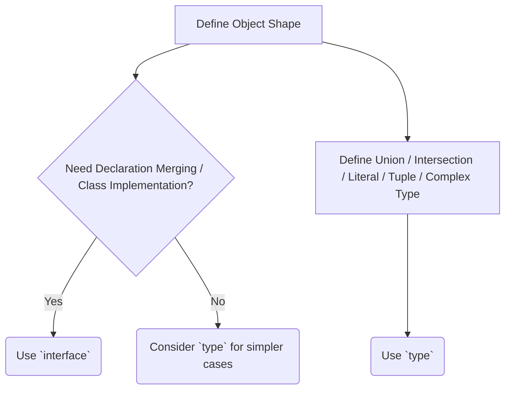

# TypeScript Tutorial: Deep Dive into Fundamentals (Day 4)

Welcome back to our TypeScript learning journey! If you've been following along, you've likely grasped the fundamental "why" behind TypeScript and its basic type system. You've seen how it brings safety and predictability to JavaScript, transforming dynamic chaos into structured order. But TypeScript's true power lies in its nuanced type annotations, powerful inference capabilities, and sophisticated tooling that goes far beyond simple `string` or `number` declarations.

Today, we're shifting gears from the absolute basics to an intermediate understanding of TypeScript's core building blocks. We'll explore advanced aspects of type annotations, delve into the intricacies of object and array typing, uncover the true potential of functions with TypeScript, and demystify critical concepts like type assertions versus type guards. Our goal is to equip you with the knowledge to write more robust, maintainable, and expressive TypeScript code in real-world applications.

This session is designed for developers who have already experimented with TypeScript and understand its basic syntax. We'll be focusing on the practical depth and the subtle distinctions that differentiate good TypeScript code from great TypeScript code. Get ready to elevate your TypeScript game!

## Type Annotations: Beyond the Basics

While basic type annotations like `let name: string;` are foundational, TypeScript offers a rich set of features to define more complex and precise types. Understanding these will unlock a new level of type safety and code clarity.

### Union Types & Intersection Types

We often encounter scenarios where a variable can hold one of several possible types, or needs to combine properties from multiple types.

#### Union Types (`|`)

A union type describes a value that can be one of several types. It's often used for function parameters or return types that can vary.

```typescript
// Example: A function argument that can be a string or a number
function printId(id: number | string) {
  console.log(`Your ID is: ${id}`);

  // Type narrowing: TypeScript needs to know which type it is before
  // allowing type-specific operations.
  if (typeof id === 'string') {
    console.log(`ID length: ${id.length}`); // OK: 'id' is narrowed to 'string'
  } else {
    console.log(`ID squared: ${id * id}`); // OK: 'id' is narrowed to 'number'
  }
}

printId(101); // Your ID is: 101, ID squared: 10201
printId("202ABC"); // Your ID is: 202ABC, ID length: 6

// Example: Literal Union Type - restrict values to specific literals
type TrafficLightColor = "red" | "yellow" | "green";

function changeLight(color: TrafficLightColor) {
  console.log(`Changing light to ${color}`);
}

changeLight("red");
// changeLight("blue"); // Error: Argument of type '"blue"' is not assignable to parameter of type 'TrafficLightColor'.
```

#### Intersection Types (`&`)

An intersection type combines multiple types into a *single* type that has *all* the properties of the combined types. It's like merging objects.

```typescript
interface HasName {
  name: string;
}

interface HasAge {
  age: number;
}

// A Person must have both a 'name' and an 'age'
type Person = HasName & HasAge;

const developer: Person = {
  name: "Alice",
  age: 30,
};

console.log(`${developer.name} is ${developer.age} years old.`);

// Example: Combining types from different sources
interface Product {
  id: string;
  name: string;
  price: number;
}

interface Discountable {
  discount: number; // as a percentage
}

// A DiscountedProduct has all properties of Product AND Discountable
type DiscountedProduct = Product & Discountable;

const laptop: DiscountedProduct = {
  id: "LT456",
  name: "Super Laptop",
  price: 1200,
  discount: 15, // 15% off
};

console.log(`${laptop.name} (ID: ${laptop.id}) original price: $${laptop.price}, with ${laptop.discount}% discount.`);
```

### Type Aliases (`type`) vs. Interfaces (`interface`)

This is a common point of confusion. Both `type` and `interface` can define object shapes, but they have key differences.

#### Interfaces (`interface`)

*   **Primary use:** Defining object shapes and class contracts.
*   **Declaration Merging:** Interfaces with the same name automatically merge their properties. This is especially useful for augmenting existing types from libraries.
*   **Extend/Implement:** Can `extend` other interfaces and `implement` by classes.

```typescript
interface User {
  id: number;
  name: string;
}

interface User { // Declaration merging - adds 'email' to the existing User interface
  email: string;
}

interface Admin extends User { // Extend another interface
  permissions: string[];
}

const regularUser: User = { id: 1, name: "John Doe", email: "john@example.com" };
const adminUser: Admin = { id: 2, name: "Jane Smith", email: "jane@example.com", permissions: ["manage_users", "manage_products"] };

class DatabaseUser implements User { // Class implements interface
  constructor(public id: number, public name: string, public email: string) {}
}
```

#### Type Aliases (`type`)

*   **Primary use:** More versatile. Can define primitive aliases, union types, intersection types, tuples, and complex mapped types.
*   **No Declaration Merging:** A `type` alias with the same name cannot be declared twice; it will cause a compile-time error.
*   **Extend/Implement:** Cannot directly `extend` or `implement` in the same way interfaces do, but can achieve similar composition using intersection types (`&`).

```typescript
type ID = number | string; // Alias for a union type

type Point = { // Alias for an object shape
  x: number;
  y: number;
};

type Coordinates = [number, number]; // Alias for a tuple

type APIResponse = {
  data: any;
  status: number;
  message?: string;
};

// Combining types with intersection for similar "extension"
type SuperUser = User & {
  superPowers: string[];
};

const superAdmin: SuperUser = {
  id: 3,
  name: "Clark Kent",
  email: "clark@dailyplanet.com",
  superPowers: ["flight", "strength"],
};
```

#### When to Use Which?

*   **Prefer `interface` for object shapes** when you might need declaration merging (e.g., library augmentation) or when defining public APIs.
*   **Prefer `type` for everything else:** unions, intersections, literal types, tuples, complex function signatures, and when you want to define a specific type alias for primitives.
*   **Rule of thumb:** If you need to describe a specific object structure, start with an `interface`. If you need to combine types, create an alias for a union or intersection.



## Mastering Arrays and Tuples

Arrays are ubiquitous in JavaScript, and TypeScript significantly enhances their safety. Tuples, a special kind of array, offer even more precise control.

### Array Types

TypeScript allows you to specify the type of elements an array can hold.

```typescript
// Array of numbers
let numbers: number[] = [1, 2, 3];
// let numbers: Array<number> = [1, 2, 3]; // Alternative generic syntax

// Array of strings
let names: string[] = ["Alice", "Bob", "Charlie"];

// Array of objects matching an interface
interface ProductItem {
  id: string;
  name: string;
  quantity: number;
}

let cart: ProductItem[] = [
  { id: "P1", name: "Laptop", quantity: 1 },
  { id: "P2", name: "Mouse", quantity: 2 },
];

// Array of mixed types (using a union type)
let mixedArray: (string | number)[] = ["hello", 123, "world"];
```

### Tuples: Fixed-Size, Fixed-Type Arrays

Tuples are a special array type with a fixed number of elements, where each element has a known type. They are perfect for representing pairs or fixed-length lists of related values.

```typescript
// Example: RGB color value as a tuple
type RGB = [number, number, number];

const red: RGB = [255, 0, 0];
const green: RGB = [0, 255, 0];

// const invalidColor: RGB = [255, 0]; // Error: Source has 2 elements, but target requires 3.
// const invalidType: RGB = ["255", 0, 0]; // Error: Type 'string' is not assignable to type 'number'.

// Example: Representing a point (x, y)
type Point2D = [x: number, y: number]; // Labeled tuple elements (TS 4.0+)
const origin: Point2D = [0, 0];
const pointA: Point2D = [10, 20];

// Accessing elements
console.log(`X coordinate: ${pointA[0]}, Y coordinate: ${pointA[1]}`);

// Destructuring tuples
const [xCoord, yCoord] = pointA;
console.log(`Destructured X: ${xCoord}, Y: ${yCoord}`);

// Tuples with optional elements and rest elements (advanced)
type APIResponseStatus = [number, string?, ...boolean[]];
const successResponse: APIResponseStatus = [200, "OK"];
const errorResponse: APIResponseStatus = [404, "Not Found", true, false];
const simpleStatus: APIResponseStatus = [500];
```
Tuples are often overlooked but can bring significant type safety to functions returning multiple related values or configurations.

## Functions in TypeScript: A Deeper Look

Functions are the building blocks of most applications, and TypeScript provides powerful features to define their types, ensuring correct usage and reliable behavior.

### Function Signatures and Overloads

TypeScript allows you to define multiple function signatures for a single function implementation, enabling richer and safer overloaded functions.

```typescript
// Function overload signatures
function add(a: number, b: number): number;
function add(a: string, b: string): string;
function add(a: string, b: number): string;
function add(a: number, b: string): string;
// Implementation signature (must be compatible with all overloads)
function add(a: any, b: any): any {
  if (typeof a === 'number' && typeof b === 'number') {
    return a + b;
  }
  return String(a) + String(b);
}

console.log(add(5, 3));         // Output: 8 (number)
console.log(add("Hello", "World")); // Output: HelloWorld (string)
console.log(add("Age: ", 30));  // Output: Age: 30 (string)
console.log(add(10, " items")); // Output: 10 items (string)

// add(true, false); // Error: No overload matches this call.
```
Function overloads allow you to precisely define how a function can be called, improving type checking for callers.

### Optional and Default Parameters

TypeScript makes it easy to declare function parameters as optional or to provide default values.

```typescript
function greet(name: string, greeting?: string) { // Optional parameter
  if (greeting) {
    console.log(`${greeting}, ${name}!`);
  } else {
    console.log(`Hello, ${name}!`);
  }
}

greet("Alice");           // Hello, Alice!
greet("Bob", "Good morning"); // Good morning, Bob!

function sendMessage(message: string, sender: string = "System") { // Default parameter
  console.log(`[${sender}]: ${message}`);
}

sendMessage("Welcome to the chat!");         // [System]: Welcome to the chat!
sendMessage("Are you there?", "User123");  // [User123]: Are you there?
```

### Rest Parameters

When a function needs to accept an indefinite number of arguments of the same type, rest parameters come in handy.

```typescript
function sumAll(...numbers: number[]): number {
  return numbers.reduce((total, num) => total + num, 0);
}

console.log(sumAll(1, 2, 3));        // Output: 6
console.log(sumAll(10, 20, 30, 40)); // Output: 100
console.log(sumAll());               // Output: 0
```

## Type Assertions vs. Type Guards: Navigating Unknown Types

Dealing with `any` or `unknown` types is inevitable when interacting with external APIs or dynamic data. TypeScript provides two primary mechanisms to work with these types safely: type assertions and type guards.

### Type Assertions (`as` keyword or `<Type>value`)

A type assertion tells the TypeScript compiler, "Trust me, I know better, this value is of this type." It's like casting in other languages, but it provides no runtime checks.

```typescript
let someValue: unknown = "this is a string";

// Using 'as' keyword (preferred in TSX/React)
let strLength: number = (someValue as string).length;
console.log(strLength); // Output: 18

// Using angle-bracket syntax (can conflict with JSX syntax)
let upperCaseValue: string = (<string>someValue).toUpperCase();
console.log(upperCaseValue); // Output: THIS IS A STRING

// Pitfall: If you assert incorrectly, you get a runtime error, not a compile-time error.
let anotherValue: unknown = 42;
// let badLength: number = (anotherValue as string).length; // No compile-time error
// console.log(badLength); // Runtime error: TypeError: Cannot read properties of undefined (reading 'length')
```
**Use type assertions sparingly** and only when you are absolutely certain about the type, typically after performing your own runtime checks or when dealing with external libraries where you know the type contracts.

### Type Guards

Type guards are special expressions that perform a runtime check, narrowing down the type of a variable within a certain scope. They are the *safe* way to deal with union types or `unknown`.

#### `typeof` Type Guard

Works for primitives (`string`, `number`, `boolean`, `symbol`, `bigint`, `undefined`, `object`, `function`).

```typescript
function printLength(input: string | number) {
  if (typeof input === 'string') {
    console.log(input.length); // input is narrowed to 'string'
  } else {
    console.log(input.toFixed(2)); // input is narrowed to 'number'
  }
}
```

#### `instanceof` Type Guard

Checks if a value is an instance of a specific class.

```typescript
class Dog {
  bark() { console.log("Woof!"); }
}

class Cat {
  meow() { console.log("Meow!"); }
}

function makeSound(animal: Dog | Cat) {
  if (animal instanceof Dog) {
    animal.bark(); // animal is narrowed to 'Dog'
  } else {
    animal.meow(); // animal is narrowed to 'Cat'
  }
}

makeSound(new Dog()); // Woof!
makeSound(new Cat()); // Meow!
```

#### `in` Operator Type Guard

Checks if an object has a specific property.

```typescript
interface Car {
  drive(): void;
}

interface Boat {
  sail(): void;
}

function operateVehicle(vehicle: Car | Boat) {
  if ('drive' in vehicle) {
    vehicle.drive(); // vehicle is narrowed to 'Car'
  } else {
    vehicle.sail(); // vehicle is narrowed to 'Boat'
  }
}

// Example usage (assuming Car and Boat classes exist)
// class MyCar implements Car { drive() { console.log('Driving car'); } }
// class MyBoat implements Boat { sail() { console.log('Sailing boat'); } }
// operateVehicle(new MyCar());
// operateVehicle(new MyBoat());
```

#### User-Defined Type Guards

You can create your own type guard functions that return a special type predicate: `parameterName is Type`.

```typescript
interface Bird {
  fly(): void;
  layEggs(): void;
}

interface Fish {
  swim(): void;
  layEggs(): void;
}

// User-defined type guard
function isFish(pet: Bird | Fish): pet is Fish {
  return (pet as Fish).swim !== undefined;
}

function getAnimalAction(pet: Bird | Fish) {
  if (isFish(pet)) {
    pet.swim(); // 'pet' is narrowed to 'Fish'
  } else {
    pet.fly();  // 'pet' is narrowed to 'Bird'
  }
}

// Example usage
// class Tuna implements Fish { swim() { console.log('Swimming!'); } layEggs() {} }
// class Eagle implements Bird { fly() { console.log('Flying!'); } layEggs() {} }
// getAnimalAction(new Tuna());
// getAnimalAction(new Eagle());
```

**Recommendation:** Always prefer type guards over type assertions when dealing with unknown types, as they provide runtime safety and allow TypeScript to correctly infer types.

## Real-World Use Cases

Let's see these concepts in action in production scenarios.

1.  **API Response Handling (Union & Intersection Types, Type Guards):**
    When fetching data from an API, the response might vary based on success or error.

    ```typescript
    interface SuccessResponse {
      status: 'success';
      data: any; // Could be more specific like UserData | ProductData
    }

    interface ErrorResponse {
      status: 'error';
      message: string;
      code?: number;
    }

    type APIResult = SuccessResponse | ErrorResponse;

    function handleAPIResponse(response: APIResult) {
      if (response.status === 'success') { // Type guard based on literal property
        console.log("Data received:", response.data);
      } else {
        console.error("API Error:", response.message, response.code);
      }
    }

    // Example API calls
    handleAPIResponse({ status: 'success', data: { user: 'Alice' } });
    handleAPIResponse({ status: 'error', message: 'Unauthorized', code: 401 });
    ```

2.  **Configuration Objects (Type Aliases & Optional Properties):**
    A common pattern is to define a configuration object with optional settings.

    ```typescript
    type AppConfig = {
      appName: string;
      version: string;
      debugMode?: boolean; // Optional property
      apiEndpoint: string;
      timeoutMs?: number;  // Optional with default in function
    };

    function initializeApp(config: AppConfig) {
      const { appName, version, debugMode = false, apiEndpoint, timeoutMs = 5000 } = config;
      console.log(`Initializing ${appName} v${version}`);
      console.log(`Debug Mode: ${debugMode ? 'On' : 'Off'}`);
      console.log(`API Endpoint: ${apiEndpoint}`);
      console.log(`Request Timeout: ${timeoutMs}ms`);

      // ... actual initialization logic
    }

    initializeApp({
      appName: "MyWebApp",
      version: "1.0.0",
      apiEndpoint: "https://api.mywebapp.com",
    });

    initializeApp({
      appName: "AdminDashboard",
      version: "2.1.0",
      debugMode: true,
      apiEndpoint: "https://admin-api.mywebapp.com",
      timeoutMs: 10000,
    });
    ```

3.  **Event Handling (Tuples, Union Types, Function Overloads):**
    Dispatching and handling events often involves a payload with varying types.

    ```typescript
    type EventPayload = [string, number] | [string, string]; // Example: [eventName, data]

    // Overloaded function for dispatching events
    function dispatchEvent(eventName: string, data: number): void;
    function dispatchEvent(eventName: string, data: string): void;
    function dispatchEvent(eventName: string, data: number | string): void {
      console.log(`Dispatching event: ${eventName} with data: ${data}`);
      // In a real app, this would use an actual event bus or mechanism
    }

    dispatchEvent("userLoggedIn", 123);
    dispatchEvent("productAdded", "P-ABC-123");
    ```

## Common Pitfalls & Best Practices

### Pitfalls

*   **Over-using `any`**: While convenient, `any` bypasses TypeScript's type checking, defeating its purpose. It's a quick fix that often leads to runtime bugs.
*   **Incorrect Type Assertions**: Blindly asserting types (`as MyType`) without runtime validation can lead to `undefined` errors at runtime, which TypeScript was supposed to prevent.
*   **Confusing `type` and `interface`**: While often interchangeable for object shapes, not understanding their differences (especially declaration merging) can lead to unexpected behavior or limitations when working with complex projects or libraries.
*   **Neglecting Type Narrowing**: Forgetting to use type guards (`typeof`, `instanceof`, `in`, user-defined) when dealing with union types, forcing you to use unsafe type assertions.

### Best Practices

*   **Be Explicit, But Leverage Inference**: Type annotations are great, but let TypeScript infer types where it can, especially for simple variable assignments. This keeps your code concise.
*   **Prefer Type Guards over Assertions**: Always use type guards (`if (typeof val === 'string')`) for runtime checks and type narrowing. Reserve type assertions for situations where you have external knowledge not available to the compiler.
*   **Use `interface` for Public APIs/Library Extensions**: For reusable components or extending third-party library types, `interface` is often a better choice due to declaration merging.
*   **Use `type` for Unions, Intersections, and Complex Aliases**: When creating new composite types or aliases for primitives, `type` is more flexible and appropriate.
*   **Strive for Strict Mode**: Enable `strict` mode in `tsconfig.json`. This turns on a suite of stricter type-checking options (`noImplicitAny`, `strictNullChecks`, etc.), forcing you to write more robust and safer code.
*   **Document Complex Types**: For very complex `type` aliases or `interface` definitions, add comments to explain their purpose and constraints.
*   **Use Tuples for Fixed-Length Collections**: When you expect a specific number of items with specific types in an array-like structure (e.g., `[string, number, boolean]`), use tuples for clarity and safety.

## Summary

Today, we journeyed deeper into the fundamental concepts of TypeScript, moving beyond basic declarations to explore the nuances that make TypeScript a powerful tool for large-scale application development.

Key takeaways include:

*   **Union (`|`) and Intersection (`&`) Types** provide powerful ways to combine and compose types for flexible and precise definitions.
*   **Type Aliases (`type`) and Interfaces (`interface`)** both define object shapes, but `interface` supports declaration merging and class implementation, while `type` is more versatile for unions, tuples, and other complex type constructs.
*   **Arrays** can be strongly typed for their elements, while **Tuples** provide fixed-length, fixed-type arrays for highly specific data structures.
*   **Functions** gain significant type safety through explicit parameter and return type annotations, **overloads** for different call signatures, and support for **optional**, **default**, and **rest** parameters.
*   **Type Guards** (`typeof`, `instanceof`, `in`, user-defined) are the safest way to narrow types at runtime, providing compile-time assurance.
*   **Type Assertions (`as Type`)** should be used cautiously, as they override the compiler's checks without runtime validation.
*   **Real-world scenarios** demonstrate how these concepts build robust API handlers, flexible configuration systems, and type-safe event dispatchers.
*   **Best practices** emphasize using TypeScript's features for safety and clarity, avoiding `any`, and preferring type guards over assertions.

By mastering these intermediate fundamentals, you're well on your way to writing TypeScript that is not only correct but also elegant and maintainable. Keep practicing, and you'll find TypeScript becomes an indispensable ally in your development workflow.

Tags: `typescript tutorial` `typescript fundamentals` `type aliases` `interfaces` `union types` `intersection types` `type guards` `type assertions` `typescript functions` `tuples` `best practices`

---

> **Auto-generated by GitHub Growth Engine** | Topic: typescript tutorial | Day 4 | Phase: Introduction & Fundamentals | Difficulty: intermediate
